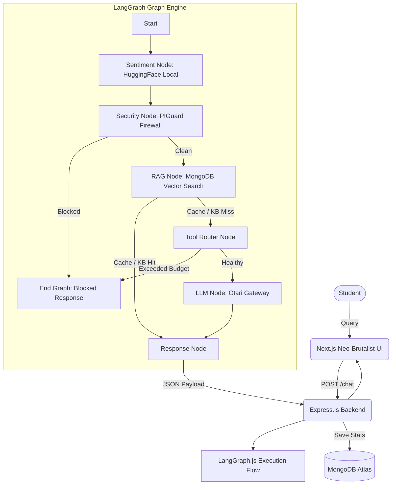

<div align="center">
  
  <h1>IRIS Bot | FlowZint AI Hackathon 2026</h1>
  <p><strong>The Cognitive Routing AI Support Chat Bot with LangGraph.js & Vector RAG</strong></p>
  <p>Category: <strong>Support Chat Bot / Intelligent Assistants</strong></p>

  [](https://opensource.org/licenses/MIT)
  [](https://flowzint.in/2026/ai/hackothon/)
</div>

---

## 🏆 Problem Statement

AI is transforming education and customer support, but **premium large language models (LLMs) are too expensive** for continuous usage, and **budget models aren't capable enough** for complex problems.

Existing support and tutoring systems typically suffer from:
1. **High API Costs**: Routing every question to Claude Sonnet or GPT-4, leading to massive deficits.
2. **Poor User Experience**: Hardcoding budget rules that restrict users to low-tier, hallucination-prone models.
3. **Stateless Pipelines**: Simple prompt-response loops lacking agentic decision-making, memory, or context.

---

## 💡 Our Solution: IRIS Bot (Intelligent Routing Assistant)

**IRIS Bot** is a cost-aware, self-optimizing AI Support Chatbot built for students and educational platforms. 

Using **LangGraph.js**, IRIS Bot functions as a stateful AI agent that evaluates intent, checks a vector search database, performs sentiment checks, and dynamically routes queries to the most cost-effective model capable of answering correctly:

*   **Zero-Cost Vector RAG** → Answered locally from MongoDB Atlas vectors (Cost: **$0.00**)
*   **Simple Fact Lookup** → Routed to Kimi K2.6 (Cost: **$0.0004**)
*   **Guided Explanations** → Routed to Claude Haiku 4.5 (Cost: **$0.0012**)
*   **Deep Reasoning / Code** → Routed to Claude Sonnet 4.6 (Cost: **$0.0060**)
*   **Multimodal / Visuals** → Grounded search & image analysis via Google Gemini 3.5 Flash

---

## 🏗️ Technical Architecture & Workflow



### 🧠 The LangGraph.js Agent Graph Nodes
1. **Sentiment Node**: Analyzes text locally using HuggingFace Transformers.js (`distilbert`). If the student displays frustration, the agent skips Socratic mode to answer directly and empathetically.
2. **Security Node**: Enforces the **PIGuard Firewall** (heuristics + regex patterns) to intercept prompt injection attempts.
3. **RAG Node**: Generates local 384-dimensional embeddings (`all-MiniLM-L6-v2`) and searches a local vector store in MongoDB Atlas for instant answers at $0 cost.
4. **Tool Router Node**: Runs complexity classifiers and applies budget degradation limits.
5. **LLM Node**: Formulates the system prompt (incorporating web search findings and socratic tutor parameters) and invokes the Otari Gateway.
6. **Response Node**: Intercepts leaks (Layer 3), saves conversation details, caches responses, and outputs stats to the frontend.

---

## ✨ Features & Functionality

### 1. 🔍 Production-Grade Vector RAG
* Overhauled RAG engine running **MongoDB Atlas Vector Search**.
* Generates embeddings locally using `@huggingface/transformers` (`Xenova/all-MiniLM-L6-v2`).
* Zero latency to external embedding APIs, reducing security risks and keeping costs at zero.

### 2. 💚 Emotion-Aware AI
* Real-time local sentiment classification on every message.
* Emits WebSocket status markers to show a **Sentiment Badge** next to messages (😊, 🙂, 😐, 😕, 😤).
* Empathy-driven behavior shift: switches to concise, comforting responses when consecutive negative messages are detected.

### 3. 🖼️ Multimodal Support via Gemini
* Integrates Google Gemini 3.5 Flash using the modern `@google/genai` SDK.
* Handles student uploads of diagrams, math sheets, and code screenshots.
* Built-in grounding simulation for when API keys are not supplied.

### 4. 📊 Dashboard Analytics
* **Cost Savings Waterfall**: Live timeline tracking the cumulative savings of dynamic routing compared to hardcoded Sonnet models.
* **Student Satisfaction Timeline**: Historical tracking of student sentiment patterns over the course of learning sessions.
* **Agent thinking progress**: Interactive progress graph showing the LangGraph node transition state machine.

---

## 🛠️ Tech Stack

*   **Frontend**: Next.js 14, React 19, Tailwind CSS v4, Framer Motion, Recharts, Three.js
*   **Backend**: Node.js, Express, Mongoose, Socket.io
*   **AI Engine**: LangGraph.js, LangChain Core, HuggingFace Transformers.js, Google GenAI SDK, Mozilla Otari API
*   **Database**: MongoDB (Atlas Vector Search)

---

## 🚀 Installation & Local Setup

### Prerequisites
* Node.js v20+
* MongoDB connection URI
* Mozilla Otari API Key
* Gemini API Key (Optional)

### 1. Clone the repository
```bash
git clone https://github.com/shivam77kk/iris-bot-flowzint-hackathon.git
cd iris-bot-flowzint-hackathon
```

### 2. Setup Backend (.env)
```bash
cd backend
npm install
```
Create a `backend/.env` file with:
```env
PORT=5000
MONGO_URI=your_mongodb_atlas_uri
OTARI_API_KEY=your_otari_api_key
OTARI_BASE_URL=https://api.otari.ai/v1
JWT_SECRET=super_secret_session_key
SESSION_BUDGET=2.00
GEMINI_API_KEY=your_google_gemini_key
```

### 3. Seed Knowledge Base Vector Embeddings
Run the vector seeder script to populate your MongoDB Atlas cluster with local embeddings:
```bash
node scripts/seed-vectors.js
```

### 4. Run Servers
* **Backend**: `npm run dev` (starts on port 5000)
* **Frontend**: `cd ../frontend && npm install && npm run dev` (starts on port 3000)

Visit `http://localhost:3000` to interact with IRIS Bot!

---

## 🧑‍💻 Team

**Shivam Tonpe** 
*   Email: shivamtonpe175@gmail.com
*   GitHub: [shivam77kk](https://github.com/shivam77kk)

---
*Submitted for the FlowZint AI Hackathon 2026*
