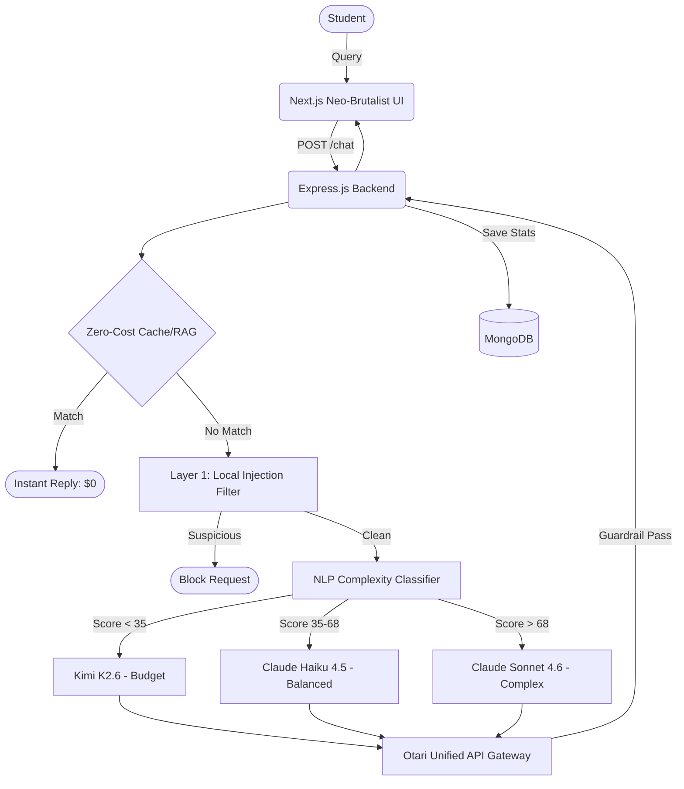

  
  <h1>IRIS Bot | FlowZint AI Hackathon 2026</h1>
  
<strong>The Cost-Aware Educational Support Chat Bot</strong>

  
Category: <strong>Support Chat Bot</strong>

  
  

---

## 🏆 Problem Statement

AI is transforming education, but **premium models are too expensive** for students, and **budget models aren't smart enough** for complex problems. 

Educational platforms either:
1. Eat massive API costs allowing unrestricted usage of GPT-4/Claude Sonnet.
2. Provide a poor user experience by restricting students to cheap, hallucination-prone models.

## 💡 Our Solution: IRIS Bot

**IRIS Bot** is a smart educational support bot that introduces **Cost-Aware Dynamic Routing**. 
Instead of sending every query to the most expensive model, IRIS Bot analyzes the *intent, complexity, and domain* of the student's question and routes it to the most cost-effective model capable of answering it correctly.

### 💰 The Result? Up to 93% Cost Savings

*   "What is HTTP?" → **Routed to Kimi K2.6** (Cost: $0.0004)
*   "Explain TCP vs UDP" → **Routed to Claude Haiku 4.5** (Cost: $0.0012)
*   "Write a React app with WebSockets" → **Routed to Claude Sonnet 4.6** (Cost: $0.0060)

## ✨ Key Features

1.  **🧠 Dynamic Query Classifier**: An NLP pipeline that evaluates lexical/syntactic complexity and domain specificity to assign a "Routing Score" (0-100).
2.  **🛡️ 3-Layer PIGuard Security**: Defends against prompt injection via local heuristics, Otari gateway blocking, and post-inference response validation.
3.  **💸 Real-Time Budget Tracking**: Interactive dashboard showing exact token usage, cost savings compared to worst-case routing, and budget degradation logic.
4.  **📚 Zero-Cost RAG**: Frequently asked questions are routed to a local Knowledge Base (KB), costing $0.00.
5.  **🌐 Live Web Search**: Fallback to DuckDuckGo scraping for queries requiring up-to-date 2026 information.

## 🏗️ Technical Architecture

## 🛠️ Tech Stack

*   **Frontend**: Next.js 14, React, Tailwind CSS (Neo-Brutalist), Framer Motion, Three.js (Avatar)
*   **Backend**: Node.js, Express, Mongoose
*   **Database**: MongoDB (Atlas)
*   **AI Orchestration**: Mozilla Otari API (Kimi K2.6, Claude Haiku 4.5, Claude Sonnet 4.6)
*   **Security**: Custom Regex + Otari Guardrails

## 🚀 Setup Instructions

### Prerequisites
- Node.js (v18+)
- MongoDB connection string
- Mozilla Otari API Key

### 1. Clone the repository
\`\`\`bash
git clone https://github.com/shivam77kk/iris-bot-flowzint-hackathon.git
cd iris-bot-flowzint-hackathon
\`\`\`

### 2. Backend Setup
\`\`\`bash
cd backend
npm install
# Create a .env file based on the provided instructions
npm run dev
\`\`\`

### 3. Frontend Setup
\`\`\`bash
cd frontend
npm install
npm run dev
\`\`\`

Visit `http://localhost:3000` to interact with IRIS Bot.

## 🧑‍💻 Team

**Shivam Tonpe** 
*   Email: shivamtonpe175@gmail.com
*   GitHub: [shivam77kk](https://github.com/shivam77kk)

---
*Submitted for the FlowZint AI Hackathon 2026*
